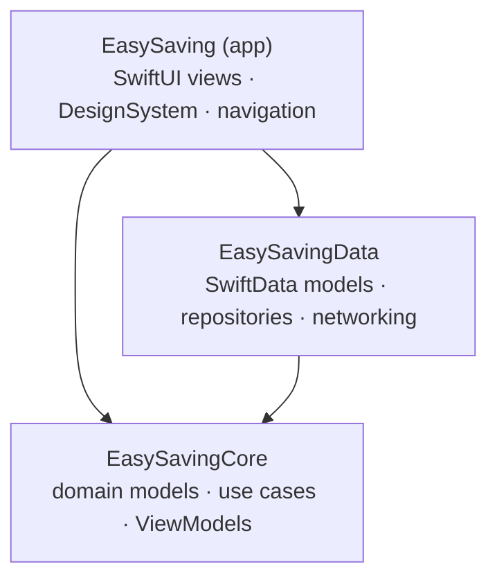

# EasySaving

A personal finance (budgeting) iOS app: record expenses and income, browse
analytics by category and over time, and convert amounts using live exchange
rates. Built as a portfolio project to demonstrate senior-level native iOS
engineering — every architectural decision is documented and justified.

> 🚧 **Status: Sprint 0 — walking skeleton.** Project scaffolding, module
> boundaries, tooling and CI are being laid down before any feature code.

## Tech stack

| | |
|---|---|
| Language | Swift 6, strict concurrency enabled |
| UI | SwiftUI only, iOS 17+, `@Observable` |
| Architecture | MVVM-C, modular SPM package |
| Persistence | SwiftData behind repository protocols |
| Networking | Hand-rolled `URLSession` async/await client |
| DI | Initializer injection + composition root |
| Testing | Swift Testing · snapshot tests · integration tests |
| Tooling | SwiftLint · SwiftFormat · Fastlane · GitHub Actions |

## Architecture

One app target plus a local SPM package (`EasySavingKit`) with two library
targets, cut along the core/infrastructure line:



`EasySavingCore` never imports SwiftUI, SwiftData or UIKit — the dependency
direction is compiler-enforced where possible and SwiftLint-enforced where
the SDK makes frameworks ambient (see `custom_rules` in `.swiftlint.yml`).

Full rationale for every decision lives in [docs/ADR.md](docs/ADR.md);
per-task history in [docs/TASK_LOG.md](docs/TASK_LOG.md).

### Setup

```bash
bundle install
```

SwiftLint and SwiftFormat need no separate installation: they are consumed
as SPM plugins pinned by `Package.resolved`.
